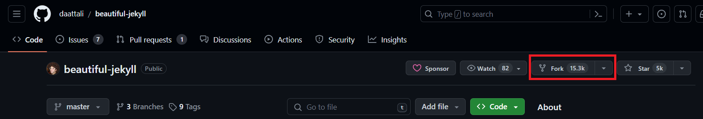
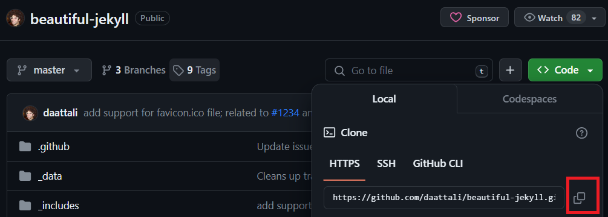
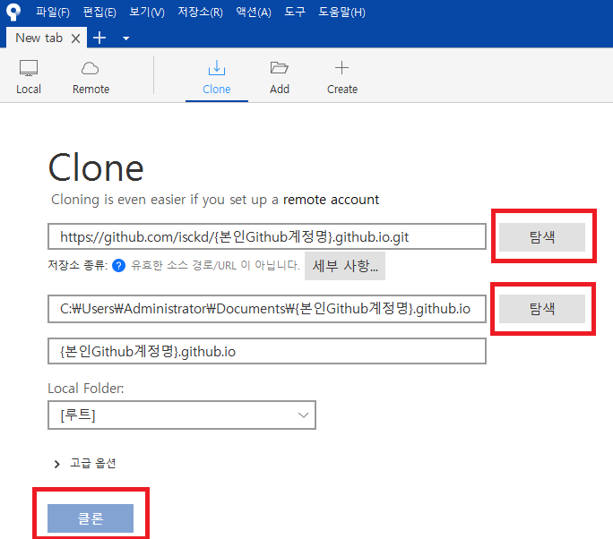
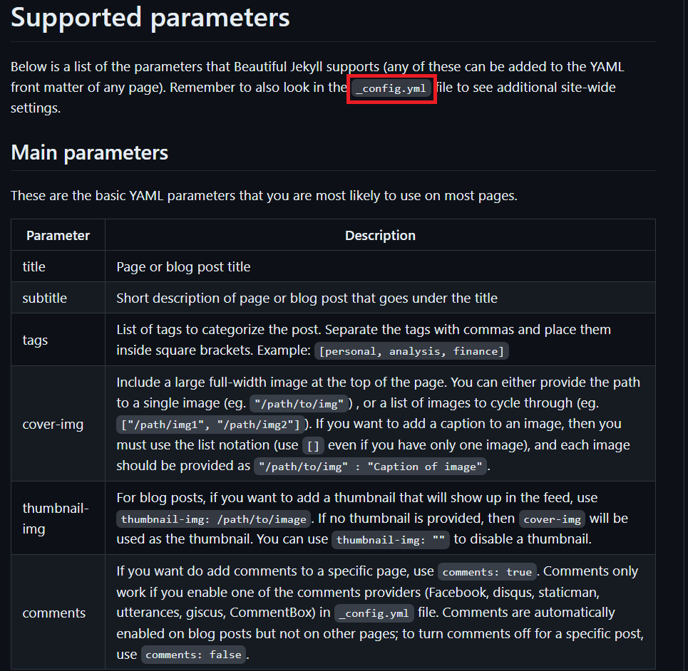
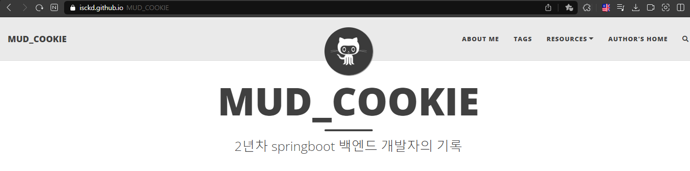

# 1. 블로그 플랫폼 선정
2024년을 맞아 개발하면서 느낀 점을 나만의 공간에 정리해야겠다는 다짐을 하며, <br>
다른 사람과 지식 공유를 할 수 있는 블로그를 만들고 싶었다. <br>

개발자가 많이 작성하는 블로그 플랫폼을 찾아보니 여러가지가 있었다.
- Tistory
- Notion
- Velog
- Medium
- WordPress
- Github Pages

각자의 단점을 나열해보면서 깃허브 블로그로 선택한 이유를 말해보고자 한다.
### Tistory
- 직관적이고, 접근성이 좋지만 구글에 노출되는 티스토리 포스팅 내용을 보면 잘못된 정보를 올린 글들이 몇몇 보여 인식이 그렇게 좋지는 않음.


### Notion
- 블로그 기능 말고도 매우 많은 기능들을 지원, UI 깔끔함. 다만 현 회사 업무용 노트북으로 접속이 안된다..


### Velog
- 개발자들이 많이 쓰는 블로그, markdown 형식 지원. 다만 커스텀에 제한이 있음.


### Medium
- Velog 와 마찬가지로 개발자들이 애용함, 매우 심플함. 다만 무료 포스팅 개수 제한이 있음..


### WordPress
- 내 입맛대로 커스터마이징이 가능함. 다만 일반적으로 WordPress 를 구축하려면 개인 서버에 올리거나, 가입을 해 사용하는 등 유지비용이 듦. 가장 큰 단점은 PHP 와 나는 좀 거리가 멀다.


### Github Pages
- 내 입맛대로 커스터마이징이 가능하고, commit 기록이 남아 관리에 조금 더 용이하다. 구글 노출도 나쁘지 않다.

<br><br>

# 2. Jekyll 테마 선정
Jekyll은 GitHub Pages 및 간소화된 빌드 프로세스를 기본적으로 지원하는 정적 사이트 생성기이다.
Github Pages 공식 Document 에서도 Jekyll 사용을 적극 권장하고 있다. <br>
[Gihtub Pages Docs - Jekyll](https://docs.github.com/ko/pages/setting-up-a-github-pages-site-with-jekyll/about-github-pages-and-jekyll)

Jekyll 을 사용하는 사람이 많은 만큼, 무료 테마(템플릿)를 쉽게 구할 수 있다.<br>
나는 [지킬 테마 무료 사이트](https://jekyllthemes.io/free) 에서 가장 많은 사람들이 사용한 
[beautilful Jekyll theme](https://jekyllthemes.io/theme/beautiful-jekyll) 을 사용했다.

<br><br>

# 3. Github Pages 에 Jekyll 테마 적용하기
우선 [내가 선택한 테마의 github 링크](https://github.com/daattali/beautiful-jekyll) 에서 소스코드를 받아와야 한다. 만약 다른 테마를 적용하고 싶다면 다른 해당 테마의 github 링크에서 받아오면 된다.<br>
우선 소스코드를 내 Repository 로 가져오기 위한 Fork 를 진행한다.

**Fork 진행 시 Repository name 은 으로 *{본인Github계정명}.github.io*  으로 진행한다.**

Fork 가 완료되었다면, 본인 Github 에 Repository 가 만들어졌을 것이다.<br>
이것을 로컬PC 에 옮겨와야 하는 작업(clone) 을 진행해야 한다.
 git clone 을 하기 위해 해당 repository 의 HTTPS 링크를 복사한다.

로컬 PC 에 git clone 하는 방법은 git bash, 다른 터미널 창에서 시도해도 되지만, 나는 GUI 가 잘 구성된 Soucretree 에서 실행한다. <br>

상단의 + 버튼으로 새로운 탭을 만들고, 그 바로 하단의 Clone 을 진입한다. <br>
첫번째 입력칸에는 복사한 git clone 링크를 넣고 탐색을 누르면, 로컬PC 의 어느 디렉토리에 넣을건지 창이 뜬다. <br>
Sourcetree 에 익숙하지 않은 사람을 위해 잠깐 주의사항을 말하자면, 
'탐색' 왼쪽이 실제 clone 될 프로젝트의 경로가 되므로 잘 기억해두어야 한다.


정상적으로 완료되었다면, 로컬 PC 의 해당 디렉토리에 {본인Github계정명.github.io} 라는 폴더가 만들어졌을 것이다. 이 상태에서 아무 commit & push 를 진행하면 실제 Github Pages 에 반영이 된다. <br>
단순히 fork 만 했다고 Github Pages 에 올라가지는 않기 때문. <br>
그러면 아주 간단한 수정사항만 commit & push 해보도록 하자. <br>
[내가 pork 한 Jekyll 테마 Github 링크](https://github.com/daattali/beautiful-jekyll) 에 가보면 테마 제작자의 설명이 README 에 작성되어있다. <br>
해당 테마 말고도 다른 테마 역시 README 정도는 작성되었을 것이니 걱정하지 말자.

위를 살펴보면 _config.yml 파일의 파라미터에 해당하는 값이 무얼 뜻하는지 나와있다. <br>
**앞으로도 블로그의 전반적인 세팅을 하려면 해당 파일에서 파라미터를 수정하면 된다.** <br>
clone 했던 내 로컬PC의 디렉토리를 진입해서, _config.yml 파일을 들어가서,
```yml
layout: home
title: My website
subtitle: This is where I will tell my friends way too much about me
```
라고 되어 있던 것을
```yml
layout: home
title: {메인페이지 명}
subtitle: {부제}
```
으로 변경후, commit & push 해보자. <br>
commit & push 는 내가 위에서 언급한 Sourcetree 에서 간편한게 할 수 있으니 참고바란다.
정상적으로 commit & push 가 완료되었다면, 대략 2~3분 뒤에 <br>
{본인Github계정명.github.io} 의 url 로 접속하면 실제 Github Pages 가 서버에 등록되었음을 확인할 수 있다!!

<br><br>

***

{: .box-note}
현재 포스팅에서는 beautiful-Jekyll 테마를 fork 해 public repository 로 고정되었지만, <br>
fork 하지 않고 개인 private repository 에 소스코드를 붙여넣어 사용해도 된다. <br>
다만 Github Pages 는 private repository 에서 호스팅하려면<br>
Github Pro 급 이상의 계정이 필요함에 유의하자.

***


현재 내가 반영한 코드를 확인하려면 commit&push 후 2~3분간 대기해야 된다는 단점이 있다.<br>
다음 포스팅에는 commit 하기 전에 내 로컬PC 에서 변경사항을 브라우저상에서 실시간으로 확인하는 방법에 대해 다루고자 한다.

[깃허브 블로그 만들기2 - 로컬PC에서 실시간 변경사항 확인](https://isckd.github.io/2024-01-01-make-github-blog(2))