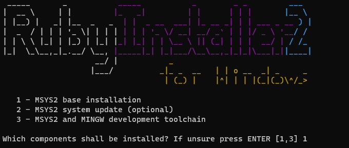
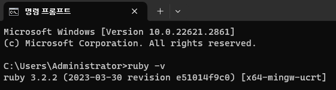
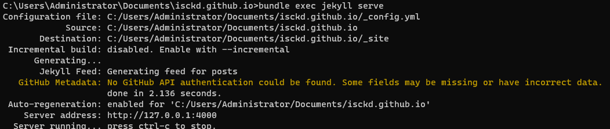
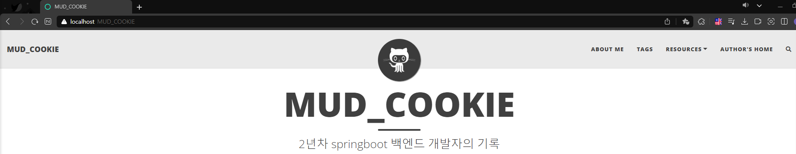

[깃허브 블로그 만들기1 - 로컬PC에서 실시간 변경사항 확인](https://isckd.github.io/2023-12-31-make-github-blog(1)) 에 이어서 포스팅한다.
# 1. Ruby 설치
로컬PC 에서 Jekyll 을 구동하기 위해서는 Ruby 언어를 로컬에 설치해야 한다. <br>
[Ruby 다운로드 링크](https://rubyinstaller.org/downloads/) <br>
한가지 중요한 점은, Jekyll 버전과 호환성이 맞는 Ruby 언어를 다운받는 것이다. <br>
내가 사용하는 Jekyll 의 버전을 확인하는 방법은, 지킬 테마를 설치한(git clone) 디렉토리의 <br>
**.gemspec** 파일을 확인하면 된다. <br>
내가 사용한 beautiful-jekyll-theme 에서는 beautiful-jekyll-theme.gemspec 파일이 존재했다.

```ruby
# frozen_string_literal: true

Gem::Specification.new do |spec|
  spec.name          = "beautiful-jekyll-theme"
  spec.version       = "6.0.1"
  spec.authors       = ["Dean Attali"]
  spec.email         = ["daattali@gmail.com"]

  spec.summary       = "Beautiful Jekyll is a ready-to-use Jekyll theme to help you create an awesome website quickly. Perfect for personal blogs or simple project websites, with a focus on responsive and clean design."
  spec.homepage      = "https://beautifuljekyll.com"
  spec.license       = "MIT"

  spec.files         = `git ls-files -z`.split("\x0").select { |f| f.match(%r{^(assets|_layouts|_includes|LICENSE|README|feed|404|_data|tags|staticman)}i) }

  spec.metadata      = {
    "changelog_uri"     => "https://beautifuljekyll.com/updates/",
    "documentation_uri" => "https://github.com/daattali/beautiful-jekyll#readme"
  }

# "jekyll", "~> 3.9.3" 으로 Jekyll 버전이 3.9.3 임을 확인할 수 있다.
  spec.add_runtime_dependency "jekyll", "~> 3.9.3"
  spec.add_runtime_dependency "jekyll-paginate", "~> 1.1"
  spec.add_runtime_dependency "jekyll-sitemap", "~> 1.4"
  spec.add_runtime_dependency "kramdown-parser-gfm", "~> 1.1"
  spec.add_runtime_dependency "kramdown", "~> 2.3.2"
  spec.add_runtime_dependency "webrick", "~> 1.8"

  spec.add_development_dependency "bundler", ">= 1.16"
  spec.add_development_dependency "rake", "~> 12.0"
end
```

이제 jeykyll 버전과 호환되는 ruby 언어를 구글링해 지원여부를 확인하면 된다. <br>
나는 이 부분을 간과했다가 2023.12.31기준 Jekyll 3.9.3 에 ruby 3.3 버전을 사용했다가 한참동안 애를 먹었던 경험이 있어 공유한다.. ruby 3.2 로 교체 후 실행하니 잘 되었다.<br>

우선 ruby 설치 프로그램 실행 후, 작업이 완료되면 윈도우 기준 cmd 창이 열린다. <br>
<br>
위 창에서 1, Enter 를 누르면 설치가 마무리된다.

여기까지 잘 따라왔다면, 설치가 잘 되었는지 아래 명령어로 버전을 확인해보자.
```bash
ruby -v
```


<br>
# 2. 로컬에서 구동
설치가 잘 되었다면 기존 cmd 창을 닫고, 새로운 cmd 창을 열어보자. <br>
꼭 cmd 가 아니어도 된다. bash 나 다른 터미널을 이용해도 된다. <br>
진입 후, 아래와 같이 Jekyll 테마를 clone 한 디렉토리로 이동한다.<br>
나는 C 드라이브의 users/Documents/{Github계정명.github.io} 에 위치시켜 놓았다.<br>
```bash
cd Documents/{Github계정명.github.io}
```
CLI 환경이 익숙하지 않은 사람들을 위해 추가 언급하자면, cd 는 현재 내가 위치한 곳을 옮긴다는 뜻이다. <br>
경로명이 잘 기억나지 않는다면, cmd 기준 dir 명령어와 ../ 를 잘 활용하여 찾길 바란다. <br>

여기서 바로 구동시키는 것이 아니라, 필요한 gem 들을 추가적으로 받아야 한다.<br>
cmd 창이 아닌 윈도우 환경에서 Jekyll 테마를 clone 한 위치에서, Gemfile 을 아래와 같이 수정후 저장한다. <br>
메모장으로 편집하든, vs code 에디터로 편집하든 수정만 하면 된다.
```ruby
# frozen_string_literal: true

source "https://rubygems.org"

gemspec

gem "webrick", "~> 1.8"

gem "github-pages", group: :jekyll_plugins

gem "tzinfo-data"
gem "wdm", "~> 0.1.0" if Gem.win_platform?

# If you have any plugins, put them here!
group :jekyll_plugins do
  gem "jekyll-paginate"
  gem "jekyll-sitemap"
  gem "jekyll-gist"
  gem "jekyll-feed"
  gem "jemoji"
  gem "jekyll-algolia"
  gem 'jekyll-include-cache'
  gem 'github-pages'
  gem 'faraday-retry'
  gem 'csv'
end
```
위는 내가 추가적으로 필요한 bundle 을 설치하지 않고 서버를 구동시켰을 때 <br>
나오는 에러들을 기준으로 추가한 bundle 들이다.<br>
이 글을 본 사람들은 고생하지 말고 편하게 작업하길 바란다..<br>

아래는 Github Pages 공식 Document 에서 Jekyll 로컬 구동 방법에 대한 내용인데, <br>
ruby 3.0 이상부터는 webrick 을 수동으로 설치해야 된다는 내용이 있다.
위 Gemfile 에도 추가해놓긴 했지만 혹시 모르니 cmd 창에서도 실행한다.<br>
[Github Pages 공식 Document](https://docs.github.com/ko/pages/setting-up-a-github-pages-site-with-jekyll/testing-your-github-pages-site-locally-with-jekyll)
```bash
bundle add webrick
```
이후 Gemfile 을 기준으로 install 을 진행한다. 물론 cmd 창 기준이다.
```bash
bundle install
```
이제 서버를 구동해본다.
```bash
bundle exec jekyll serve
```
정상적으로 구동이 된다면, 아래와 같은 로그가 출력될 것이다. <br>
다른 로그가 출력된다면, 버전 호환성이나 bundle 이 제대로 설치되지 않았을 가능성이 커<br>
로그 파일을 보면서 Gemfile 에 bundle 을 추가하면 된다.


로그를 보면 https://127.0.0.1:4000 라는 서버가 구동주소가 출력된 것을 볼 수 있다. <br>
브라우저를 열고, localhost:4000 또는 127.0.0.1:4000 를 url 입력창에 넣으면 끝이다. <br>
만약 localhost:4000 을 제대로 인식하지 못한다면, host 매핑이 제대로 안 되어 있으니
C:\Windows\System32\drivers\etc\hosts 파일을 확인하기 바란다. <br>



여기까지 잘 따라왔다면 에디터 상에서 수정 후 브라우저에서 새로고침하면<br>
수정내역이 바로 적용됨을 확인할 수 있다.

Jekyll 구조와 beautiful-Jekyll 테마의 구조를 잘 모르는 사람들을 위해 간략히 설명하자면, <br>
_posts 디렉토리 내부에 작성한 것을 기준으로 포스팅이 된다. <br>
아래 링크에서는 _config.yml 파일과 post 에 --- --- 사이에 작성되는 파라미터에 대한<br>
설명이 나와있다. 이를 참고해서 블로그를 작성하는데 도움이 되었으면 한다. <br>
[beautiful-Jekyll 테마 깃허브 respository](https://github.com/daattali/beautiful-jekyll)

다음 포스팅에는 댓글 기능을 구현하려고 한다. 여기서부터는 선택사항인데, 관심이 있다면 진행해보자.<br>
[깃허브 블로그 만들기3 - 댓글 기능 구현 (Feat. Utterances)](https://isckd.github.io/2024-01-01-make-github-blog(3))